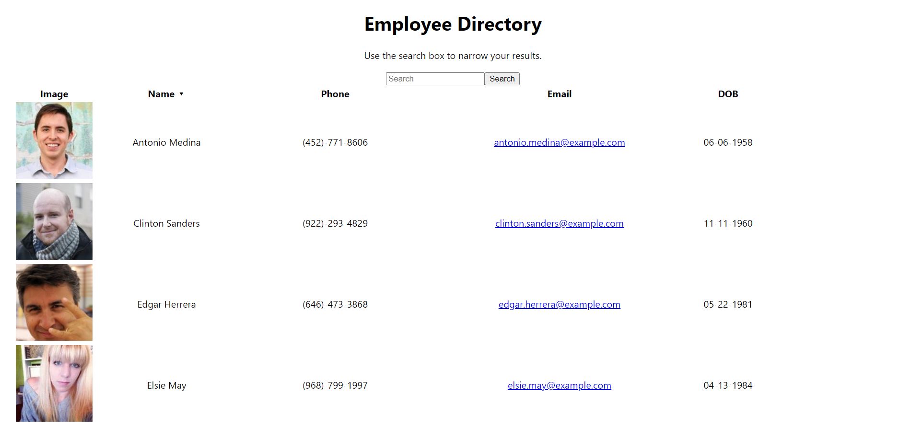

# react-employee-directory
This react app is an employee directory that receives data from an api call and generates a webpage that lets you see your employee data and search and sort by name.

    
* [Installation](#Installation)
    
* [Instructions](#Instructions)

* [Deployed Link](#Deployed-Link)
    
* [License](#License)
       
    ## Installation
    Make sure that you have Nodejs already installed. Run the command "npm i" to install packages and start localhost server with the command: "node server.js".
    ## Instructions
    You cna search for an employee by name with the search box or sort them alphabetically by name by clicking on the name column.
    ## Deployed Link
    https://employee-directory-holzer.herokuapp.com/ 

    ## License 
    This project is licensed under the MIT license
    - Email: timiholzer@gmail.com - GitHub Repo: https://github.com/timholzer/react-employee-directory